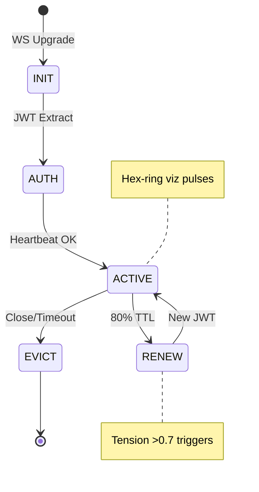
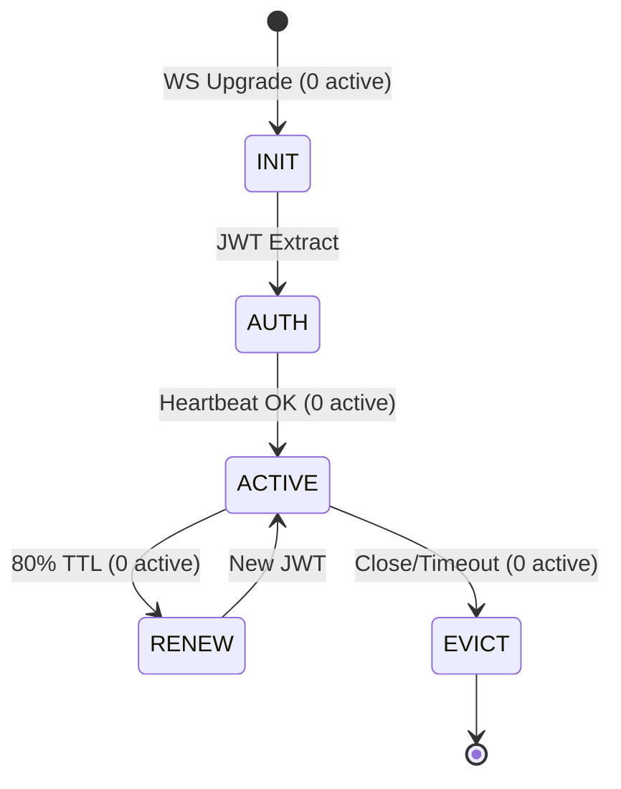
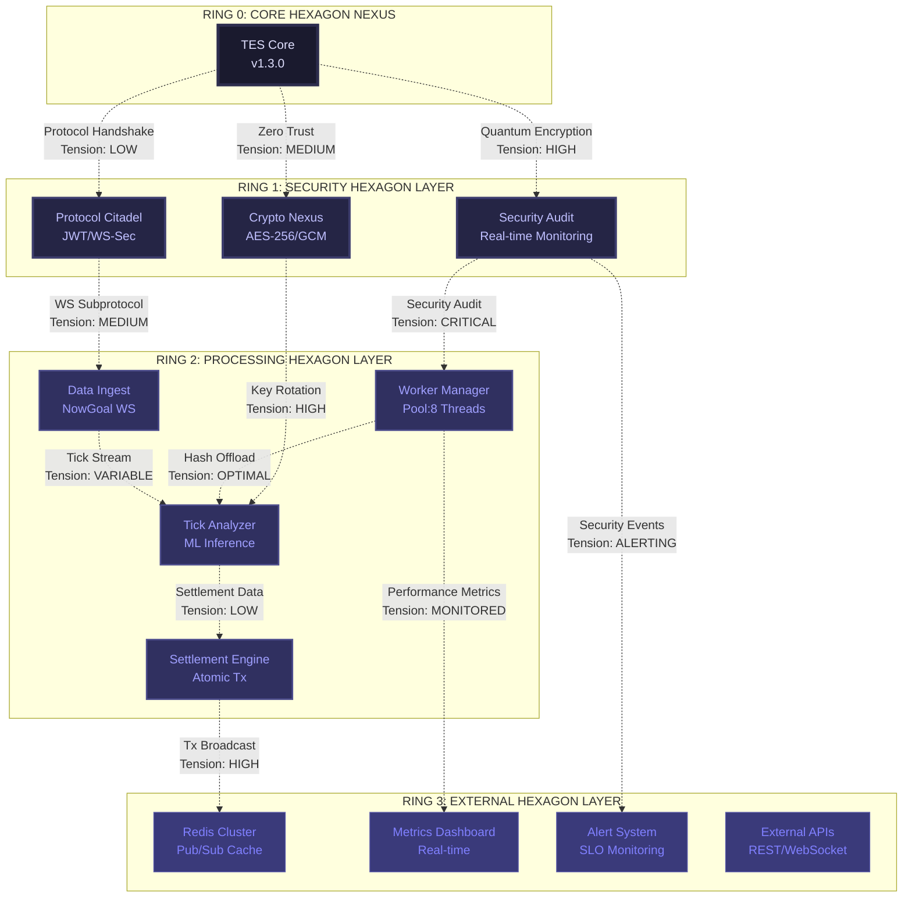

# TES Lifecycle Architecture

**Status**: ✅ **IMPLEMENTED**  
**Version**: TES-NGWS-001.9  
**Date**: 2025-11-10

---

## Overview

TES (Transcendent Edge Sentinel) Lifecycle Architecture provides zero-npm, enterprise-grade state orchestration for WebSocket session management. The system tracks session phases, calculates tension scores, and provides real-time visualization through hex-ring dashboards.

---

## Current State

**Active Sessions**: 0  
**Last Updated**: 2025-11-10T22:02:13.634Z

---

## Lifecycle Phases

The TES lifecycle consists of five distinct phases:

1. **INIT** - WebSocket upgrade pending
2. **AUTH** - JWT validated
3. **ACTIVE** - Streaming + heartbeats
4. **RENEW** - Subprotocol rotation
5. **EVICT** - Graceful close

---

## State Diagram



---

## Dynamic State Diagram (Current)



---

## Hex Ring Architecture



---

## Tension Levels

Tension scores range from 0.0 (optimal) to 1.0 (critical). The system uses color-coded indicators:

| Level | Score Range | Color | Description |
|-------|-------------|-------|-------------|
| **OPTIMAL** | 0.0 - 0.3 | `#2d5aa0` (Calm Blue) | System operating normally |
| **LOW** | 0.3 - 0.5 | `#3d7a47` (Stable Green) | Minor stress, stable |
| **MEDIUM** | 0.5 - 0.7 | `#8a5a2d` (Warning Amber) | Elevated stress, monitor |
| **HIGH** | 0.7 - 0.9 | `#a05a2d` (High Orange) | Significant stress, alert |
| **CRITICAL** | 0.9 - 1.0 | `#a02d2d` (Critical Red) | System overload, evict imminent |

---

## API Endpoints

### GET `/api/lifecycle/export`

Export lifecycle visualization data.

**Response**:
```json
{
  "data": [
    {
      "sessionID": "uuid-here",
      "phase": "ACTIVE",
      "tension": 0.45
    }
  ],
  "count": 1,
  "timestamp": 1762812133634
}
```

---

[DOMAIN:nowgoal26.com][SCOPE:LIFECYCLE][META:TES-NGWS-001.9][SEMANTIC:ARCH-VISUALIZATION][TYPE:STATE-ORCHESTRATOR][#REF]{BUN-API:1.3.WORKER-INTROSPECT}
